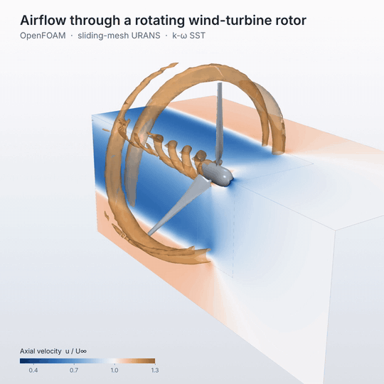

# wind-turbine-rotor-cfd

Transient OpenFOAM simulation of a three-bladed model wind-turbine rotor. The rotor
turns through the mesh on a sliding interface (AMI), resolving the tip vortices, the
wake and the slow-down of the air ahead of the blades.



*Air speed around the spinning rotor. Blue: air slowed by the blades, to about half speed in the wake. Pale orange: air speeding up as it flows around the wake. Amber: tip vortices trailing from each blade. Full video: media/rotor.mp4.*

* Rotor: 3 blades, S826 airfoil, 0.9 m diameter, 10 m/s, tip speed ratio 6
* Solver: `pimpleFoam`, k-ω SST, sliding mesh (`cyclicAMI`)
* Mesh: `blockMesh` + `snappyHexMesh`, presets coarse / medium / fine

## Requirements

* OpenFOAM v2306 or newer (openfoam.com)
* Python 3 with numpy and scipy only to regenerate the blade geometry (optional)

## Usage

```sh
cd case
./Allrun -preset coarse -np 8       # mesh and solve
./Allclean
```

Wind speed and tip speed ratio are set in `case/system/caseParameters`.

## Credits

Blade chord and twist from Krogstad & Eriksen (2013), *Renewable Energy* 50, 325-333,
as tabulated by P. Bachant (CC-BY 4.0). S826 airfoil coordinates from Somers (2005),
NREL/SR-500-36344.

## License

MIT, see `LICENSE`.
